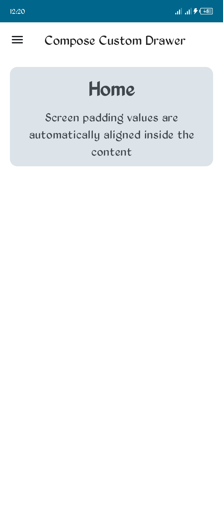
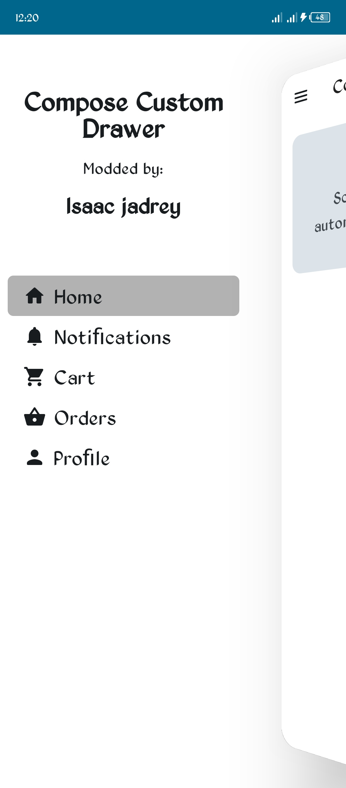
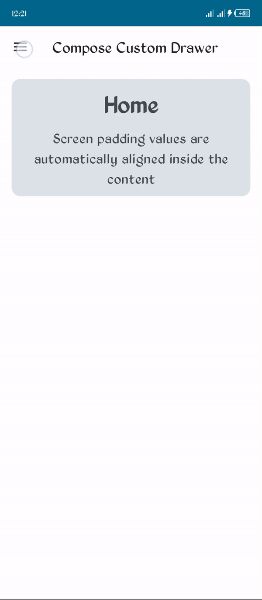

<div align="center">
  <h1>Compose Custom Scaffold</h1>
  <h4>This is a custom compose scaffold library that draws a custom navigation drawer and puts the rest of the App UI on top of the drawer at the
  screen edge instead of using the default ModalDrawer that comes with the default Scaffold, which draws the drawer on top of the App UI with a 
  Scrim that blocks interaction with the rest of the App UI.</h4>

  [](https://jitpack.io/#isaacjadrey/Custom-Compose-Scaffold)
  [](https://android-arsenal.com/api?level=24)
  [](https://github.com/isaacjadrey/Custom-Compose-Scaffold/pulls)
  
  [](https://github.com/isaacjadrey/Custom-Compose-Scaffold/LICENSE)

  <h5>The library is based on https://github.com/razaghimahdi/Card-Drawer</5> Card-Drawer library
</div>

## Quick Start:
To get the Git project in to your build:

1. Add the JitPack repository to your settings.properties file 
```Kotlin
dependencyResolutionManagement {
    repositoriesMode.set(RepositoriesMode.FAIL_ON_PROJECT_REPOS)
    repositories {
        google()
        mavenCentral()
        maven { url 'https://jitpack.io' }
    }
}
```

2. Add the dependency in your app.module gradle file
```kotlin
dependencies {
  implementation 'com.github.isaacjadrey:Custom-Compose-Scaffold:1.0.0'
}
```

## Demo: 

| Closed | Open | Navigation
| --- | --- | --- |
|  |  |  |

## Usage:
### Case 1: Using the customScaffoldState in the drawerContent.
 
Simply create your drawer component as you would, see example below;

#### Note: The scaffoldState will only work with the CustomScaffolfState.
 
```Kotlin
import others *
import com.cwj.composecustomscaffold.CustomScaffoldState
import com.cwj.composecustomscaffold.rememberCustomScaffoldState
import kotlinx.coroutines.CoroutineScope

@Composable
fun DrawerContent(
    scope: CoroutineScope, 
    customScaffoldState: CustomScaffoldState,
    navController: NavController,
) {
  // navBackStackEnrty and currentRoute
  
  // Content Example: Your Content here.
  Column() {
    // other content desciption here like content header
      
      // Items for the nav drawer that forms the body content 
        for (screen in screens) {
            DrawerItem(item = screen, onItemClick = {
                navController.navigate(screen.route) {
                    navController.graph.startDestinationId.let {
                        popUpTo(it) {
                            saveState = true
                        }
                        launchSingleTop = true
                        restoreState = true
                    }
                    // call customScaffoldState.customDrawerState.close() by launching the coroutineScope
                    scope.launch { customScaffoldState.customDrawerState.close() }
                }
            }, selected = currentRoute == screen.route)
        }
    }
}
```

### Case 2: Using the Library CustomScaffold:
In place of the default Scaffald bundled in Compose, You could use the CustomScaffold;

```Kotlin
import others *
import com.cwj.composecustomscaffold.CustomScaffold
import com.cwj.composecustomscaffold.rememberCustomScaffoldState
import androidx.compose.runtime.rememberCoroutineScope

@Composable
fun YourAppScreen() {
    val customScaffoldState = rememberCustomScaffoldState()
    val scope = rememberCoroutineScope()
    val navController = rememberNavController()
    
    CustomScaffold(
        customScaffoldState = customScaffoldState,
        topBar = { TopBar(scope = scope, scaffoldState = scaffoldState)},
        /**
        * It's important to set the drawerBackgroundColor as this will create a unified
        * color behind and under the App UI when the drawer is Open.  
        * This is the same color that will be applied to the background of content of the drawer
        */
        drawerBackgroundColor = Color.White,
         /**
         * set gesturesEnabled to [customScaffoldState.customDrawerState.isOpen] to enable
         * drawer interaction by using gestures only when the drawer is open
         */
        
        // drawerGesturesEnabled = customScaffoldState.customDrawerState.isOpen,
        customDrawerContent = {
            DrawerContent(scope = scope, scaffoldState = customScaffoldState, navController = navController)
        },
        content = {
            AppNavHost(navController = navController)
        }
    ) 
```

## Changelog:
* **1.0.0**
    * First release
